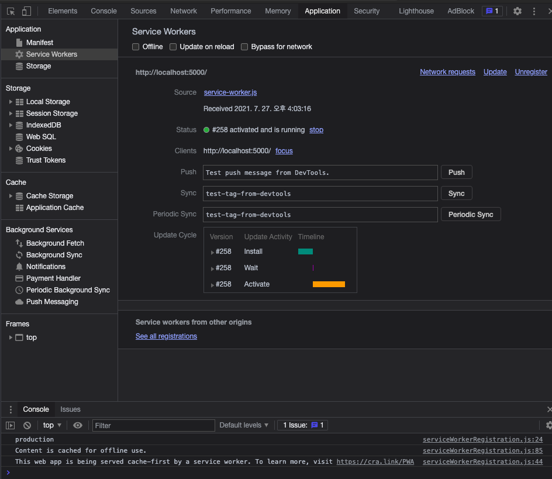

## 빠밥늦밥 PWA 버전

### 개발 기록

(다음을 순서대로 수행)

PWA 커스텀 템플릿을 사용

```
npx create-react-app pbnb-pwa --template cra-template-pwa
```

index.js의 serviceWorkerRegistration.unregister();를 serviceWorkerRegistration.register();로 수정

serve 설치

```
npm install serve
```

package.json에 다음을 추가

```
"script": {
		...
    "pwa-start": "npm run build && serve -s build",
    "pwa-build": "npm run build"
```

* 실행방법
  * 로컬실행 : npm run pwa-start
  * 배포용 빌드 : npm run pwa-build
  * 실행확인
    


---

* 참고
  * https://create-react-app.dev/docs/making-a-progressive-web-app/
  * https://create-react-app.dev/docs/custom-templates
  * https://geundung.dev/85
* 여담...
  * 원래 기본적을 create-react-app에 service-worker가 있었으나, 최근에 버전업 되면서 기본에서 빠지고 커스텀템플릿(cra-template-pwa)을 사용해야 service-worker가 설치 되는 것으로 보임

